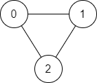
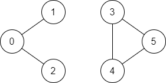

### Q1: 1971. Find if Path Exists in Graph
Example 1:



````
Input: n = 3, edges = [[0,1],[1,2],[2,0]], source = 0, destination = 2
Output: true
Explanation: There are two paths from vertex 0 to vertex 2:
- 0 → 1 → 2
- 0 → 2
````

Example 2:



````
Input: n = 6, edges = [[0,1],[0,2],[3,5],[5,4],[4,3]], source = 0, destination = 5
Output: false
Explanation: There is no path from vertex 0 to vertex 5.
````

````java
class Solution {
    public boolean validPath(int n, int[][] edges, int source, int destination) {
        
    }
}
````


### Q2: Different Input structure for above Question:
````javascript
const graph = {
    0: [1, 2],
    1: [0, 2],
    2: [0, 1]
}
````