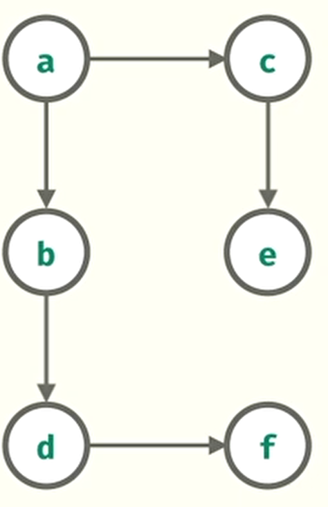
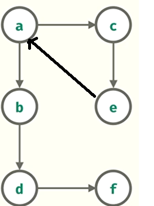
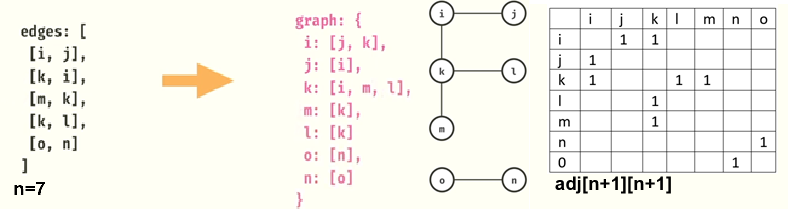
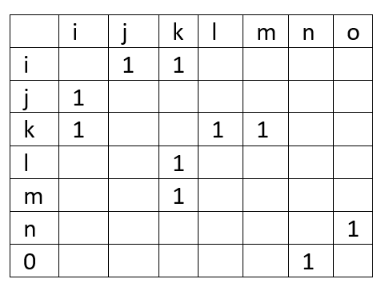
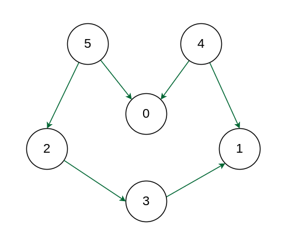
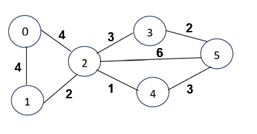
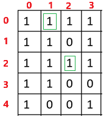

# Graph

Representation:
1.  [Connected Trio](https://leetcode.com/problems/minimum-degree-of-a-connected-trio-in-a-graph/description/) - LC:1761


### DFS
1. Closed Island -  [GFG](https://www.geeksforgeeks.org/problems/find-number-of-closed-islands/1) |  [LC-1254](https://leetcode.com/problems/number-of-closed-islands)
2. Distinct Island
3. 

### BFS
1. Rotten Orange
2. Word Ladder
3. Word Ladder-ii


### Cycle Detection / DAG
1. Cycle detection Directed graph
2. Cycle detection Undirected graph
3. Course Schedule-I  - [LC-207](https://leetcode.com/problems/course-schedule)
4. Course Schedule-II - [LC-210](https://leetcode.com/problems/course-schedule-ii)
5. Detect Cycle in 2D Grid - [LC-1559](https://leetcode.com/problems/detect-cycles-in-2d-grid)
6. Shortest Cycle in an undirected Graph
7. Detecting odd len cycle (Bipartite)
8. Maximum Employees to Be Invited to a Meeting - [LC-2127](https://leetcode.com/problems/maximum-employees-to-be-invited-to-a-meeting)


### DAG or Topological Sort
1. https://leetcode.com/problems/all-paths-from-source-to-target
2. https://leetcode.com/problems/largest-color-value-in-a-directed-graph/


### MST
1. https://leetcode.com/problems/find-critical-and-pseudo-critical-edges-in-minimum-spanning-tree/
2. https://leetcode.com/problems/min-cost-to-connect-all-points/
3. https://leetcode.com/problems/remove-max-number-of-edges-to-keep-graph-fully-traversable/


### DSU
1. https://leetcode.com/problems/redundant-connection-ii/

### Trie
1. https://www.codingninjas.com/codestudio/problems/implement-trie_631356
2. https://www.codingninjas.com/codestudio/problems/implement-trie_1387095
3. https://www.codingninjas.com/codestudio/problems/complete-string_2687860
4. https://www.codingninjas.com/codestudio/problems/count-distinct-substrings_985292
5. https://www.codingninjas.com/codestudio/problems/maximum-xor_973113
6. https://www.codingninjas.com/codestudio/problems/max-xor-queries_1382020
7. https://leetcode.com/problems/word-search-ii/


## Directed Acyclic Graph (No-Cycle):


````javascript
const graphDirected = {
    a: ['b', 'c'],
    b: ['d'],
    c: ['e'],
    d: ['f'],
    e: [],
    f: []
}
````

## Cyclic Graph


````javascript
const graphDirected = {
    a: ['b', 'c'],
    b: ['d'],
    c: ['e'],
    d: ['f'],
    e: ['a'],
    f: []
}
````

## Undirected Graph


### Adjacency Matrix Representation:
For above diagram n = 7, 
- so we will create a adjMatrix of size (n+1) * (N+1). Because array index is start at 0

- 
````java
adj[n+1][n+1]
````


## Topological Sort:



## Q: Is tracking the parent node necessary for cycle detection in an undirected graph, or is the visited set alone sufficient?
The **parent node check is necessary** to distinguish between a genuine cycle and a backtracking revisit.

The **visited set** alone is insufficient because:

### 1. False Positives Without Parent Check:
- If a node v is visited again, it could be due to a back edge (a cycle) or simply because v was visited from its neighbor (its parent in DFS).
- Without tracking the **parent**, we might incorrectly detect a cycle when encountering a previously visited node that is actually just the DFS parent.

### 2. Example of Incorrect Detection Without Parent:
Consider this undirected graph:
````lua
   1 -- 2
   |  
   3
````
- DFS from `1`: Mark `1` as visited → Visit `2` → Mark `2` as visited.
- Backtrack and visit `3` from `1`. Mark `3` as visited.
- When `3` sees `1` again, if we only check `visited`, we might think it's a cycle, but it's just the parent.

### 3. Correct Detection With Parent:
- If `v` is visited and is **not the parent** of the current node, it means there's a back edge, forming a cycle.
- Otherwise, if `v` is the parent, it’s just part of the DFS traversal, not a cycle.




