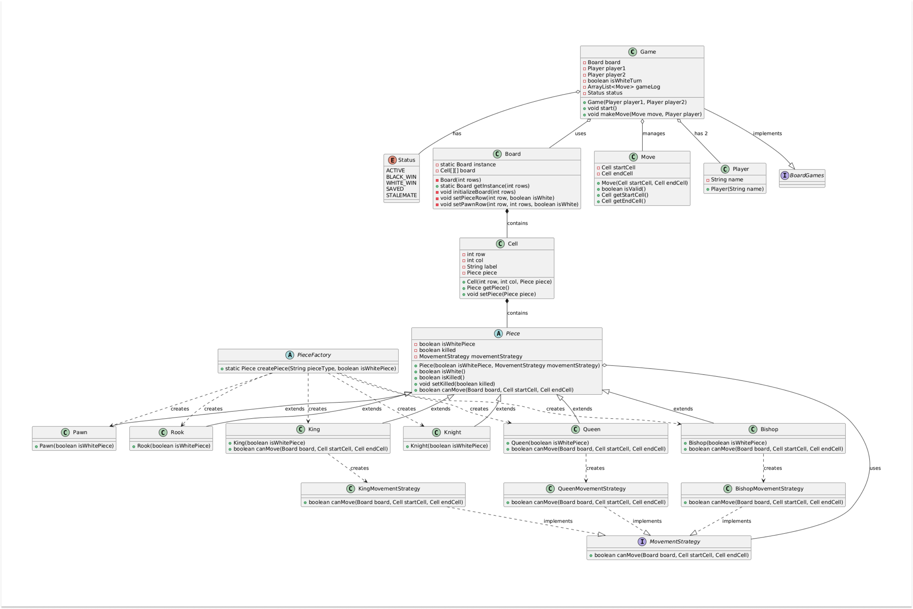
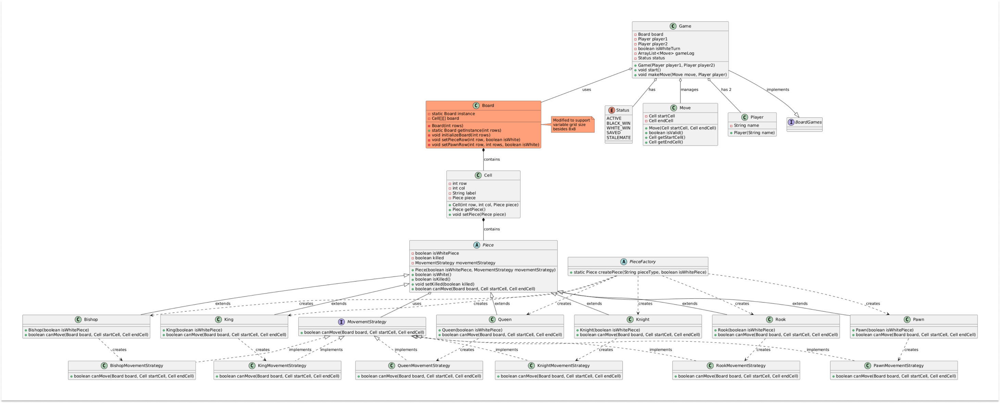
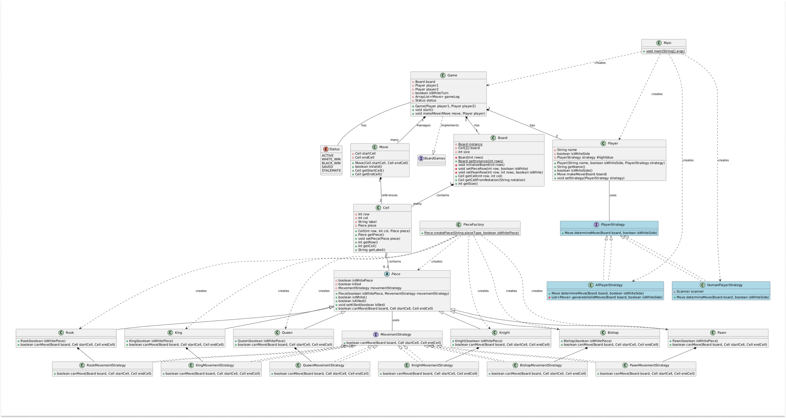

# Design Chess Game ♟️
Chess, a timeless classic, is a strategy game played between two players on an 8x8 grid. Each player commands an army of 16 pieces: one king, one queen, two rooks, two knights, two bishops, and eight pawns. The objective is to checkmate your opponent's king, placing it in a position where it cannot escape capture.
- https://codewitharyan.com/tech-blogs/design-chess-game
- [YouTube](https://youtu.be/Mmw-sEUuCNs?si=tyoz7F3n4_Lp08gC)

## Rules of the game : 
Firstly let's understand the rules of the game:

1. **Setup**: 
  - Board: The game is played on an 8x8 grid, totaling 64 squares of alternating colors (light and dark).
  - Pieces: Each player has 16 pieces, starting in predefined positions. White always starts first.
2. **Movement**:
   - King: Moves one square in any direction.
   - Queen: Moves any number of squares in any direction.
   - Rook: Moves any number of squares horizontally or vertically.
   - Bishop: Moves any number of squares diagonally.
   - Knight: Moves in an "L" shape: two squares in one direction and then one square perpendicular.
   - Pawn: Moves forward one square, but captures diagonally. Pawns can move two squares forward on their first move.
3. **Special Moves**:
   - Castling: A move involving the king and either rook where the king moves two squares towards the rook, and the rook moves to the square over which the king crossed.
   - En Passant: A special pawn capture move.
   - Pawn Promotion: A pawn reaching the far end of the board can be promoted to any piece (usually a queen).
4. **Winning the Game**:
   - Check: A king is in check if it is under threat of capture.
   - Checkmate: A king is in check and cannot escape, ending the game.
   - Stalemate: A player has no legal moves and their king is not in check, resulting in a draw.
   - Draw: The game can also end in a draw by agreement, threefold repetition, the fifty-move rule, or insufficient material.

---

# 1. Interview Setting 🤝
### Point 1 : Introduction and Vague Problem Statement

**🧑‍💼Interviewer**: Let's start with a basic problem statement. Design a Chess game system.

**🧑‍💻Candidate**: Certainly! Let me outline the flow of the game based on my understanding of Chess first:
- We have a standard 8x8 grid.
- Each player commands 16 pieces: one king, one queen, two rooks, two knights, two bishops, and eight pawns.
- The game continues until one player checkmates the opponent's king, or the game ends in a draw.

Is this the kind of game flow you had in mind?

**🧑‍💼Interviewer**: Yes, you are in-line with the flow. Please continue ahead.


### Point 2 : Clarifying requirements
🧑‍💻Candidate: Sure, I'd like to clarify a few requirements to ensure we're on the same page:
- Are we focusing on a standard 8x8 board?
- Will this be a two-player human game?
- What are the core requirements?

🧑‍💼Interviewer: We want a simple system that:
- Supports a standard 8x8 Chess game.
- Allows two human players to play.
- Provides move validation.
- Detects check, checkmate, or draw conditions.

🧑‍💻Candidate: To ensure we're on the same page, let me write down the key requirements:
- An 8x8 game board.
- Two human players.
- Alternating turns between players.
- Move validation to ensure no illegal moves are made.
- Detection of check, checkmate, or draw scenarios.

🧑‍💼Interviewer: Perfect, Let's Proceed.

### Point 3 : Identifying Key Components :
🧑‍💻Candidate: Now that we have the requirements clarified, let's identify the key components of our Chess system:
- Piece: Represents the different chess pieces (King, Queen, etc.).
- Board: The 8x8 grid where the game is played.
- Player: Each player with their pieces.

````java
public class Player {
    private String name;
    private boolean isWhiteSide;
    
    public Player(String name, boolean isWhiteSide) {
        this.name = name;
    }
    
    public String getName() {
        return name;
    }
    
    public boolean isWhiteSide() {
        return isWhiteSide;
    }
}
````

🧑‍💼Interviewer: That sounds good. Let's proceed with the design details for these components.


### Point 4 : Design Challenges
**🧑‍💼Interviewer**: What design challenges do you anticipate?

**🧑‍💻Candidate**: The Key challenges for the Tic Tac Toe game will include:
- Managing Game State: Ensuring the system accurately reflects the current state of the game, including player turns and board status.
- Implementing Move Validation: Verifying that each move is legal and within the rules of the game.
- Tracking Player Turns: Ensuring that players alternate turns correctly.
- Detecting Game-Ending Conditions: Accurately identifying check, checkmate, and draw scenarios to conclude the game appropriately.

### Point 5: Approach
**🧑‍💼Interviewer**: How would you approach these challenges to ensure our game doesn't break?

**🧑‍💻Candidate**: To tackle the design challenges, I propose utilizing design patterns effectively. Here are the strategies which I am considering along with examples:

1. Strategy Pattern for Piece Movements :
   - Define Different Movement Strategies: Implement specific movement logic for each type of piece (King, Queen, etc.).
   - Encapsulate Movement Logic: Make movement strategies interchangeable and easily extendable.
2. Singleton Pattern for Board :
   - Ensure a Single Instance: Guarantee that only one instance of the Board class exists throughout the game.
   - Global Access Point: Provide a global point of access to the board instance.
3. Factory Pattern for Piece Creation :
   - Create Pieces with a Consistent Interface: Use a factory to instantiate piece objects, ensuring they adhere to the Piece interface.
   - Enable Easy Addition of New Pieces: Allow seamless addition of new piece types without modifying existing code.
4. Manage Game State:
   - Use an Enum to track the game state (e.g., ACTIVE, SAVED, BLACK_WIN, WHITE_WIN, STALEMATE).
   ````java
   public enum Status {
       ACTIVE, SAVED, BLACK_WIN, WHITE_WIN, STALEMATE;
   }
   ````
5. Observer Pattern for Game Event Tracking:
   - Notify Listeners about Game State Changes: Allow components to listen for and react to game state changes.
   - Support Potential Future Extensions: Facilitate extensions like logging, notifications, or UI updates.


### Point 6 : Implementation
**🧑‍💼Interviewer**: Ready to discuss implementation?

**🧑‍💻Candidate**: Yes. I'll focus on a simple, readable design that meets the core Chess requirements. Here's an example of how we can utilize these design patterns:


---

# 2. Chess Design with Patterns


## 2.1. Factory Pattern for Piece Creation (Piece Factory):
1. Define the Piece Abstract class :
   ````java
   public abstract class Piece { 
       private boolean isWhitePiece;  // is the piece white piece or black piece  
       private boolean killed = false; // is the piece killed or not 
       // Constrcutor  
       public Piece(boolean isWhitePiece) { 
           this.isWhitePiece = isWhitePiece; 
       } 
       // returns piece type 
       public boolean isWhite() { 
           return isWhitePiece; 
       } 
       // returns whether a piece has been killed or not 
       public boolean isKilled() { 
           return killed; 
       } 
       // modifes the piece status upon being killed 
       public void setKilled(boolean killed) { 
           this.killed = killed; 
       } 
   }
   ````
2. Define the Concrete Classes (`King.java`, `Queen.java`, `Bishop.java`, `Knight.java`, `Rook.java`, `Pawn.java`, `PieceFactory.java` :):
   ````java
   public class King extends Piece {
       public King(boolean isWhitePiece) {
           super(isWhitePiece);
       }
   }
   ````
   ````java
   public class Queen extends Piece {
      public Queen(boolean isWhitePiece) {
         super(isWhitePiece);
      }
   }
   ````
   ````java
   public class Bishop extends Piece {
      public Bishop(boolean isWhitePiece){
         super(isWhitePiece);
      }
   }
   
   // Similar classes for Knight, Rook, and Pawn
   ````

3. Define the Piece Factory (`PieceFactory.java `):
   ````java
   public abstract class PieceFactory {
     public static Piece createPiece(String pieceType, boolean isWhitePiece) {
       switch (pieceType.toLowerCase()) {
         case "king":
           return new King(isWhitePiece);
         case "queen":
           return new Queen(isWhitePiece);
         case "bishop":
           return new Bishop(isWhitePiece);
         case "knight":
           return new Knight(isWhitePiece);
         case "rook":
           return new Rook(isWhitePiece);
         case "pawn":
           return new Pawn(isWhitePiece);
         default:
           throw new IllegalArgumentException("Unknown piece type: " + pieceType);
       }
     }
   }
   ````


## 2.2. Singleton Pattern for Board:
Before diving into the Board class, we will first focus on the Cell class, as the Cell class forms the foundation of our board. Each cell on the board is represented by an instance of the Cell class, encapsulating important attributes such as position and the piece occupying the cell.

Cell.java
````java
public class Cell {
  private int row, col;
  private String label;
  private Piece piece;
  // constructor
  public Cell(int row, int col, Piece piece) {
    this.row = row;
    this.col = col;
    this.piece = piece;
  }
  // eturns the current piece on the cell
  public Piece getPiece() {
    return piece;
  }
  // puts a piece on the cell
  public void setPiece(Piece piece) {
    this.piece = piece;
  }
}
````
Let's now also create a Move class that encapsulates all the necessary details for each move in a chess game. This class ensures a clean and structured representation of a move, including essential properties such as the starting block, ending block, the piece involved, and the timestamp.

Move.java
````java
public class Move {
  private Cell startCell;
  private Cell endCell;
  // Constructor to initialize the move with start and end cells
  public Move(Cell startCell, Cell endCell) {
    this.startCell = startCell;
    this.endCell = endCell;
  }
  // Validate if the move is valid
  public boolean isValid() {
    return !(startCell.getPiece().isWhite() == endCell.getPiece().isWhite());
  }
  // gets the start cell
  public Cell getStartCell() {
    return startCell;
  }
  // gets the end cell
  public Cell getEndCell() {
    return endCell;
  }
}
````

3. Board.java
````java
public class Board {
  private static Board instance;
  private Cell[][] board;
  // Private constructor to prevent instantiation
  private Board(int rows) {
    initializeBoard(rows);
  }

  // Method to get the single instance of Board
  public static Board getInstance(int rows) {
    if (instance == null) {
      instance = new Board(rows);
    }
    return instance;
  }

  // Initialize the board
  private void initializeBoard(int rows) {
    board = new Cell[rows][rows];
    // Setting White Pieces using PieceFactory
    setPieceRow(0, true);
    setPawnRow(1, rows, true);
    // Setting Black Pieces using PieceFactory
    setPieceRow(rows - 1, false);
    setPawnRow(rows - 2, rows, false);
    // Defining rest of the cells having no pieces
    for (int row = 2; row < rows - 2; row++) {
      for (int col = 0; col < rows; col++) {
        board[row][col] = new Cell(row, col, null);
      }
    }
  }
  // Set the major pieces for a given row
  private void setPieceRow(int row, boolean isWhite) {
    board[row][0] = new Cell(row, 0, PieceFactory.createPiece("rook", isWhite));
    board[row][1] =
        new Cell(row, 1, PieceFactory.createPiece("knight", isWhite));
    board[row][2] =
        new Cell(row, 2, PieceFactory.createPiece("bishop", isWhite));
    board[row][3] =
        new Cell(row, 3, PieceFactory.createPiece("queen", isWhite));
    board[row][4] = new Cell(row, 4, PieceFactory.createPiece("king", isWhite));
    board[row][5] =
        new Cell(row, 5, PieceFactory.createPiece("bishop", isWhite));
    board[row][6] =
        new Cell(row, 6, PieceFactory.createPiece("knight", isWhite));
    board[row][7] = new Cell(row, 7, PieceFactory.createPiece("rook", isWhite));
  }
  // Set pawns for a given row
  private void setPawnRow(int row, int rows, boolean isWhite) {
    for (int j = 0; j < rows; j++) {
      board[row][j] =
          new Cell(row, j, PieceFactory.createPiece("pawn", isWhite));
    }
  }
}
````


### 2.3. Strategy Pattern for Piece Movements :
1. Modify the Piece Class :
- Create a new interface MovementStrategy and add a canMove() method in it.
- Add a MovementStrategy attribute in the Piece class.
- Modify the constructor to accept a MovementStrategy parameter.
   ````java
   // Common Interface for the Move Strategies
   interface MovementStrategy {
      boolean canMove(Board board, Cell startCell, Cell endCell);
   }
   
   public abstract class Piece {
      private boolean isWhitePiece; // is the piece white piece or black piece
      private boolean killed = false;
      private MovementStrategy movementStrategy;
      public Piece(boolean isWhitePiece, MovementStrategy movementStrategy) {
         this.isWhitePiece = isWhitePiece;
         this.movementStrategy = movementStrategy;
      }
      public boolean isWhite() {
         return isWhitePiece;
      }
      public boolean isKilled() {
         return killed;
      }
      public void setKilled(boolean killed) {
         this.killed = killed;
      }
      public boolean canMove(Board board, Block startBlock, Block endBlock) {
         return movementStrategy.canMove(board, startBlock, endBlock);
      }
   }
   ````

2. Modify the Concrete Classes Implementations :
````java
// King class with movement strategy
public class King extends Piece {
  private MovementStrategy strategy;
  public King(boolean white) {
    super(white, new KingMovementStrategy());
  }
  @Override
  public boolean canMove(Board board, Cell startCell, Cell endCell) {
    return strategy.canMove(board, startCell, endCell);
  }
}
// Queen Class with movement strategy
public class Queen extends Piece {
  private MovementStrategy strategy;
  public Queen(boolean white) {
    super(white, new QueenMovementStrategy());
  }
  @Override
  public boolean canMove(Board board, Cell startCell, Cell endCell) {
    return strategy.canMove(board, startCell, endCell);
  }
}

// Bishop class with movement strategy
public class Bishop extends Piece {
  private MovementStrategy strategy;
  public Bishop(boolean white) {
    super(white, new BishopMovementStrategy());
  }
  @Override
  public boolean canMove(Board board, Cell startCell, Cell endCell) {
    return strategy.canMove(board, startCell, endCell);
  }
}
````
Similarly, you can define other piece classes using their respective movement strategies.


---

## Running the Game :
````java
import java.util.ArrayList;
interface BoardGames {
  // This interface illustrates how a large game company can manage multiple
  // types of games, including board games and non-board games. Tic Tac Toe is
  // an example of a game that is a child of the BoardGames interface.
}
public class Game implements BoardGames {
  private Board board;
  // Assuming player1 is always WHITE
  private Player player1;
  // Assuming player2 is always BLACK
  private Player player2;
  boolean isWhiteTurn;
  private ArrayList<Move> gameLog;
  private Status status;
  // Constructor to initialize the game with two players
  public Game(Player player1, Player player2) {
    this.player1 = player1;
    this.player2 = player2;
    this.board = Board.getInstance(8); // Initialize board with 8 rows
    this.isWhiteTurn = true;
    this.status = Status.ACTIVE;
    this.gameLog = new ArrayList<>();
  }
  // Start the game
  public void start() {
    // Continue the game till the status is active
    while (this.status == Status.ACTIVE) {
      // Player1 will make the move if it's white's turn
      // else Player2 will make the move
      if (isWhiteTurn) {
        makeMove(new Move(startCell, endCell), player1);
      } else {
        makeMove(new Move(startCell, endCell), player2);
      }
    }
  }
  // Make a move in the game
  public void makeMove(Move move, Player player) {
    // Initial check for a valid move
    // To check if source and destination don't contain the same color pieces
    if (move.isValid()) {
      Piece sourcePiece = move.getStartCell().getPiece();
      // Check if the source piece can be moved or not
      if (sourcePiece.canMove(
              this.board, move.getStartCell(), move.getEndCell())) {
        Piece destinationPiece = move.getEndCell().getPiece();
        // Check if the destination cell contains some piece
        if (destinationPiece != null) {
          // If the destination cell contains King and currently white is
          // playing --> White wins
          if (destinationPiece instanceof King && isWhiteTurn) {
            this.status = Status.WHITE_WIN;
            return;
          }
          // If the destination cell contains King and currently Black is
          // playing --> Black wins
          if (destinationPiece instanceof King && !isWhiteTurn) {
            this.status = Status.BLACK_WIN;
            return;
          }
          // Set the destination piece as killed
          destinationPiece.setKilled(true);
        }
        // Adding the valid move to the game logs
        gameLog.add(move);
        // Moving the source piece to the destination cell
        move.getEndCell().setPiece(sourcePiece);
        // Setting the source cell to null (means it doesn't have any piece)
        move.getStartCell().setPiece(null);
        // Toggling the turn
        isWhiteTurn = !isWhiteTurn;
      }
    }
  }
}
````

Main Method to Run the Game:
````java
public class Main {
    public static void main(String[] args) {
        // Create players
        Player player1 = new Player("Player1"); // White
        Player player2 = new Player("Player2"); // Black
        // Initialize game
        Game chessGame = new Game(player1, player2);
        // Start the game
        chessGame.start();
    }
}
````

🧑‍💼Interviewer: Sounds good. What makes your approach effective?

🧑‍💻Candidate: Here are the key strengths of my approach for the Chess game design:
- **Simplicity**: The design avoids unnecessary complexity and follows well-defined design patterns to keep the system minimal and straightforward.
- **Clarity**: The use of design patterns such as Factory, Singleton, Strategy, Observer, and State makes the code easy to understand, which facilitates implementation and maintenance.
- **Efficiency**: The implementation is direct and logical, ensuring smooth and efficient gameplay. Each piece's movement strategy is encapsulated, and the game board is managed as a single instance.
- **Separation** of Concerns: Each component has a clear and distinct responsibility. This enhances modularity and makes it easier to update individual parts of the system without affecting the whole.
- **Extensibility**: The design allows for seamless addition of new pieces, movement strategies, and game states without requiring significant changes to the existing code. This makes the system future-proof and adaptable to new requirements.
- **Maintainability**: With a clear structure and the use of design patterns, the system is easy to maintain. Changes can be made to specific parts without worrying about unintended side effects on other components.
- **Robustness**: Using the Strategy Pattern for piece movements ensures that each piece adheres to its movement rules. The Singleton Pattern for the board ensures consistent game state management, and the Observer Pattern allows for real-time updates on game events.

---


## 5. Extensibility (Further Improvement) : 

### 5.1 Support for Different Board Sizes : 

To allow different board sizes, modify the Board class to accept a variable grid size. This way we can make the board of any size rather than just 8*8.

````java
public class Board {
  private static Board instance;
  private Cell[][] board;
  // Private constructor to prevent instantiation
  private Board(int rows) {
    initializeBoard(rows);
  }
  // Method to get the single instance of Board
  public static Board getInstance(int rows) {
    if (instance == null) {
      instance = new Board(rows); // can take variable number of rows
    }
    return instance;
  }
  // Initialize the board
  private void initializeBoard(int rows) {
    board = new Cell[rows][rows];
    // Setting White Pieces using PieceFactory
    setPieceRow(0, true);
    setPawnRow(1, rows, true);
    // Setting Black Pieces using PieceFactory
    setPieceRow(rows - 1, false);
    setPawnRow(rows - 2, rows, false);
    // Defining rest of the cells having no pieces
    for (int row = 2; row < rows - 2; row++) {
      for (int col = 0; col < rows; col++) {
        board[row][col] = new Cell(row, col, null);
      }
    }
  }
````

### 5.2 Observer Pattern for Game Event Tracking :
Implement the Observer Pattern to notify users about each move, the current state of the game, and whose turn it is to play. This allows users to stay updated on game progress, receive notifications if they win or lose, and facilitates potential future extensions like logging and UI updates.

1. Implement the GameEventListener Interface and Concrete Listener Class
   ````java
   public interface GameEventListener { 
       void onMoveMade(Move move); 
       void onGameStateChanged(Status state); 
   }
   ````
   ````java
   public class ConsoleGameEventListener implements GameEventListener { 
       @Override 
       public void onMoveMade(Move move) { 
           System.out.println("Move made from: " + move.getStartCell().getLabel() + " to " + move.getEndCell().getLabel()); 
       } 
       @Override 
       public void onGameStateChanged(Status state) { 
           System.out.println("Game state changed to: " + state); 
       } 
   }
   ````
2.  Modify the Game Class to Accommodate the Listener :

Initialization and Constrcutor :
````java
public class Game {
    private Board board;
    // Assuming player1 is always WHITE
    private Player player1;
    // Assuming player2 is always BLACK
    private Player player2;
    private boolean isWhiteTurn;
    private ArrayList<Move> gameLog;
    private Status status;
    private GameEventListener listener;  // Single observer
    // Constructor to initialize the game with two players
    public Game(Player player1, Player player2) {
        this.player1 = player1;
        this.player2 = player2;
        // Initialize board with 8 rows
        this.board = Board.getInstance(8);
        this.isWhiteTurn = true;
        this.status = Status.ACTIVE;
        this.gameLog = new ArrayList<>();
    }
}
````

MakeMove() method :
````java
public void makeMove(Move move, Player player) {
  if (move.isValid()) {
      Piece sourcePiece = move.getStartCell().getPiece();
      if (sourcePiece.canMove(
              this.board, move.getStartCell(), move.getEndCell())) {
          Piece destinationPiece = move.getEndCell().getPiece();
          if (destinationPiece != null) {
              if (destinationPiece instanceof King && isWhiteTurn) {
                  this.status = Status.WHITE_WIN;
                  notifyGameStateChanged(
                          this.status); // notifying the users upon white winning the game
                  return;
              }
              if (destinationPiece instanceof King && !isWhiteTurn) {
                  this.status = Status.BLACK_WIN;
                  notifyGameStateChanged(
                          this.status); // notifying the users upon black winning the game
                  return;
              }
              // Set the destination piece as killed
              destinationPiece.setKilled(true);
          }
          gameLog.add(move);
          move.getEndCell().setPiece(sourcePiece);
          move.getStartCell().setPiece(null);
          // Notify listener when a move is made
          notifyMoveMade(move);
          isWhiteTurn = !isWhiteTurn;
      }
  }
}
````

Observer Methods in the Game Class :
````java
// Observer methods
public void setObserver(GameEventListener listener) {
  this.listener = listener;
}

private void notifyMoveMade(Move move) {
  if (listener != null) {
    listener.onMoveMade(move);
  }
}

private void notifyGameStateChanged(Status state) {
  if (listener != null) {
    listener.onGameStateChanged(state);
  }
}
````

Modify the Main Method to add the Observer :
````java
public class Main {
    public static void main(String[] args) {
        // Create players
        Player player1 = new Player("Player1"); // White
        Player player2 = new Player("Player2"); // Black
        // Initialize game
        Game chessGame = new Game(player1, player2);
        // Add observer for game state tracking
        chessGame.setObserver(new ConsoleGameEventListener());
        // Start the game
        chessGame.start();
    }
}
````
---

### 5.3. Strategy Pattern for Player Strategies (Human Strategy / AI Strategy) :


1. Create a Player Strategy Interface :
   ````java
   public interface PlayerStrategy {
       Move determineMove(Board board, boolean isWhiteSide);
   }
   ````
   
2. Create Concrete Strategy Classes :
   - Human Player Strategy :
   ````java
   public class HumanPlayerStrategy implements PlayerStrategy {
      private Scanner scanner = new Scanner(System.in);
      @Override
      public Move determineMove(Board board, boolean isWhiteSide) {
         System.out.println((isWhiteSide ? "White" : "Black") + " player's turn.");
         System.out.print("Enter source position (e.g., a2): ");
         String source = scanner.nextLine();
         System.out.print("Enter destination position (e.g., a4): ");
         String destination = scanner.nextLine(
                 // Convert algebraic notation to board coordinates
                 Cell startCell = board.getCellFromNotation(source);
         Cell endCell = board.getCellFromNotation(destination);
   
         return new Move(startCell, endCell);
      }
   }
   ````
   
   - AI Player Strategy :
   ````java
   public class AIPlayerStrategy implements PlayerStrategy {
     @Override
     public Move determineMove(Board board, boolean isWhiteSide) {
       // Simple AI implementation - randomly selects a valid move
       List<Move> validMoves = generateValidMoves(board, isWhiteSide);
       if (validMoves.isEmpty()) {
         throw new IllegalStateException("No valid moves available");
       }
       // Select a random move from valid moves
       Random random = new Random();
       return validMoves.get(random.nextInt(validMoves.size()));
     }
     private List<Move> generateValidMoves(Board board, boolean isWhiteSide) {
       List<Move> validMoves = new ArrayList<>();
       // Iterate through all cells on the board
       for (int row = 0; row < board.getSize(); row++) {
         for (int col = 0; col < board.getSize(); col++) {
           Cell startCell = board.getCell(row, col);
           Piece piece = startCell.getPiece();
           // Check if the cell has a piece of the correct color
           if (piece != null && piece.isWhite() == isWhiteSide) {
             // Check all possible destination cells
             for (int destRow = 0; destRow < board.getSize(); destRow++) {
               for (int destCol = 0; destCol < board.getSize(); destCol++) {
                 Cell endCell = board.getCell(destRow, destCol);
                 Move move = new Move(startCell, endCell);
                 // Check if the move is valid according to piece rules
                 if (move.isValid() && piece.canMove(board, startCell, endCell)) {
                   validMoves.add(move);
                 }
               }
             }
           }
         }
       }
       return validMoves;
     }
   }
   ````
3. Modify the Player Class to Use Player Strategy :
   ````java
   public class Player {
     private String name;
     private boolean isWhiteSide;
     private PlayerStrategy strategy;
     public Player(String name, boolean isWhiteSide, PlayerStrategy strategy) {
       this.name = name;
       this.isWhiteSide = isWhiteSide;
       this.strategy = strategy;
     }
     public String getName() {
       return name;
     }
     public boolean isWhiteSide() {
       return isWhiteSide;
     }
     public Move makeMove(Board board) {
       return strategy.determineMove(board, isWhiteSide);
     }
     // Allow changing strategy mid-game if needed
     public void setStrategy(PlayerStrategy strategy) {
       this.strategy = strategy;
     }
   }
   ````
4. Modify the Board Class to Add Helper Methods for new Strategies :
   ````java
   public class Board {
       private static Board instance;
       private Cell[][] board;
       private int size;    
       // Private constructor to prevent instantiation
       private Board(int rows) {
           this.size = rows;
           initializeBoard(rows);
       }    
       // Get a specific cell by coordinates
       public Cell getCell(int row, int col) {
           if (row < 0 || row >= size || col < 0 || col >= size) {
               return null;
           }
           return board[row][col];
       }    
       // Convert algebraic notation (e.g., "a1") to Cell
       public Cell getCellFromNotation(String notation) {
           if (notation.length() != 2) {
               throw new IllegalArgumentException("Invalid notation: " + notation);
           }        
           char file = notation.charAt(0);
           char rank = notation.charAt(1);
           
           if (file < 'a' || file >= 'a' + size || rank < '1' || rank >= '1' + size) {
               throw new IllegalArgumentException("Invalid notation: " + notation);
           }        
           int col = file - 'a';
           int row = size - (rank - '0');
           
           return board[row][col];
       }    
       // Rest of the Board class methods remain unchanged
       // ...
   }
   ````
5. Update the Game Class to Use the Player's Strategy :
   ````java
   public class Game implements BoardGames {
       private Board board;
       private Player player1; // White
       private Player player2; // Black
       private boolean isWhiteTurn;
       private ArrayList<Move> gameLog;
       private Status status;
       private GameEventListener listener;
       
       // Constructor to initialize the game with two players
       public Game(Player player1, Player player2) {
           this.player1 = player1;
           this.player2 = player2;
           this.board = Board.getInstance(8); // Initialize board with 8 rows
           this.isWhiteTurn = true;
           this.status = Status.ACTIVE;
           this.gameLog = new ArrayList<>();
       }
       
       // Start the game
       public void start() {
           // Continue the game till the status is active
           while (this.status == Status.ACTIVE) {
               Player currentPlayer = isWhiteTurn ? player1 : player2;          
               // Use player's strategy to determine the move
               Move move = currentPlayer.makeMove(board);            
               // Make the move
               makeMove(move, currentPlayer);
           }
       }    
       // Rest of the Game class methods remain unchanged
       // ...
   }
   `````
6. Update the Main Method to Use Different Player Strategies :
   ````java
   public class Main {
       public static void main(String[] args) {
           // Create players with different strategies
           Player player1 = new Player("Human Player", true, new HumanPlayerStrategy()); // White, Human
           Player player2 = new Player("AI Player", false, new AIPlayerStrategy()); // Black, AI       
           // Initialize game
           Game chessGame = new Game(player1, player2);        
           // Add observer for game state tracking
           chessGame.setObserver(new ConsoleGameEventListener());        
           // Start the game
           chessGame.start();
       }
   }
   ````

---


## Conclusion : 
This low-level design for Chess showcases a well-structured and scalable architecture, emphasizing modularity and extensibility. By supporting various enhancements such as custom board sizes and multiple players, this design ensures maintainability and flexibility. In an interview setting, presenting this design would demonstrate your ability to create robust and adaptable solutions, highlighting your proficiency in applying design patterns and best practices.