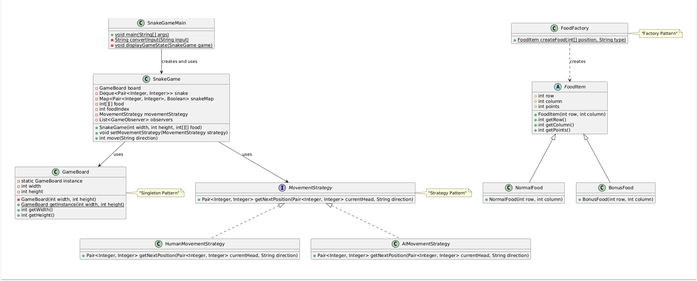
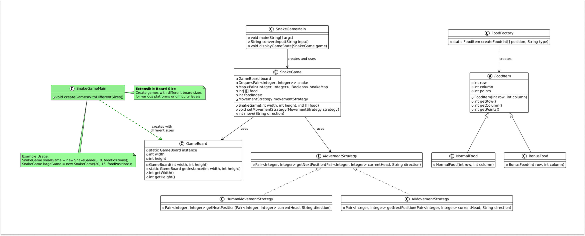
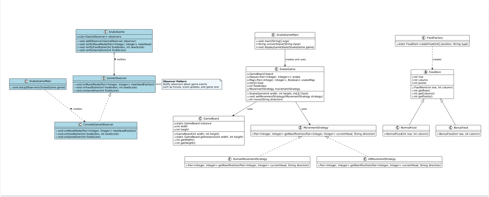
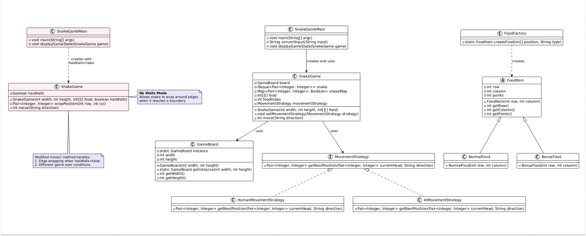

# Design Snake & Food Game 🐍🍏
The Snake & Food game is a classic arcade game where the player controls a snake moving on a grid, attempting to eat food items while avoiding collisions. The game is simple in concept but requires strategic movement to maximize the snake's growth without running into walls or itself.
- https://codewitharyan.com/tech-blogs/design-snake-food-game

## Rules of the game : 
Firstly let's understand the rules of the game:

1. **Setup**:
   - The snake starts at an initial position with a small length.
   - The player controls the movement of the snake using directional inputs (Up, Down, Left, Right).
2. **Game Mechanics**:
   - The snake moves one step at a time in the chosen direction.
   - When the snake eats a food item, it grows in length, and a new food item spawns at a random position on the grid.
   - The game continues until the snake collides with the wall or itself, at which point the game ends.
3. **Game Over Conditions**:
   - The game ends if the snake collides with the boundary of the grid.
   -  The game also ends if the snake collides with itself (i.e., its own body).

---

# 1. Interview Setting 🤝
### Point 1 : Introduction and Vague Problem Statement

**🧑‍💼Interviewer**: Let's start with a basic problem statement. Design a Snake & Food game system.

**🧑‍💻Candidate**: Sure! Based on my understanding, the game follows these key mechanics:
- A snake moves in a grid-based environment.
- The player controls the snake's movement direction.
- The snake grows when it eats food.
- The game ends if the snake collides with a wall or itself.

Is this the kind of game flow you had in mind?

**🧑‍💼Interviewer**:  Yes, you're aligned with the requirements. Please continue.


### Point 2 : Clarifying requirements

🧑‍💼Interviewer: We want a simple system that:
- Supports a standard grid-based snake game with width × height dimensions.
- Allows a player to control the snake's movement.
- Supports food placement and consumption mechanics.
- Detects collisions (self-collision and wall collision).
- Ensures proper movement and growth.
- Tracks the game score.

🧑‍💻Candidate:  To clarify, the key requirements are:
   - A game grid of specific width and height.
   - A single snake entity, controlled by the player.
   - Food objects that appear at predefined positions on the grid.
   - Movement mechanics, updating the game state with each move.
   - Collision detection for both walls and snake's body.
   - Scoring mechanism based on food consumption.

🧑‍💼Interviewer: Perfect, Let's Proceed.

### Point 3 : Identifying Key Components :
🧑‍💻Candidate: Now that we have the requirements clarified, let's identify the key components of our Snake Game system.
Game Board:
   - Class: GameBoard
   - Description: Represents the game area with specified width and height where the snake moves and food appears.

````java
public class GameBoard {
   private int width;
   private int height;

   public GameBoard(int width, int height) {
      this.width = width;
      this.height = height;
   }

   public int getWidth() { return width; }
   public int getHeight() { return height; }
}
````

Snake (`Snake.java`):
````java
public class Snake {
    private Deque<Pair<Integer, Integer>> body; // Snake body as a deque of positions
    private Map<Pair<Integer, Integer>, Boolean> positionMap; // For O(1) collision check	    
    public Snake() {
        this.body = new LinkedList<>();
        this.positionMap = new HashMap<>();
        // Initialize snake at position [0,0]
        Pair<Integer, Integer> initialPos = new Pair<>(0, 0);
        this.body.offerFirst(initialPos);
        this.positionMap.put(initialPos, true);
    }
    
    // Methods for movement, growth, collision detection
}
````

Food (`Food.java`):
````java
public class Food {
    private int[][] foodPositions;
    private int currentFoodIndex;	    
    public Food(int[][] foodPositions) {
        this.foodPositions = foodPositions;
        this.currentFoodIndex = 0;
    }	    
    // Methods for food management
}
````

Game Controller (`SnakeGame.java`):
````java
public class SnakeGame {
    private GameBoard board;
    private Snake snake;
    private Food food;
    private int score;	    
    // Game initialization and movement logic
}
````

### Point 4 : Design Challenges:
**🧑‍💼Interviewer**: What design challenges do you anticipate?

**🧑‍💻Candidate**: The key challenges in designing this game include:
   1. Efficient Snake Movement: Managing the snake's body segments during movement.
   2. Collision Detection: Efficiently detecting when the snake collides with walls or itself.
   3. Food Management: Handling the predefined food positions and consumption.
   4. Game State Management: Tracking score and detecting game over conditions.
   5. Extensibility: Allowing for different movement strategies and game configurations.


### Point 5: Design Patterns Approach:
**🧑‍💼Interviewer**: How would you approach these challenges to ensure our game doesn't break?

**🧑‍💻Candidate**: To handle these design challenges, I propose the following design patterns:

1. Strategy Pattern for Snake Movement :
   -  This pattern allows us to define a family of algorithms for snake movement, encapsulate each one, and make them interchangeable.
2. Factory Pattern for Food Placement :
   - Ensures Different food types (normal, special, poisonous) should be dynamically generated without modifying existing code.
3.  Singleton Pattern for Board :
   - Ensures that only one instance of the game board exists
4. Observer Design Pattern for Score Updates:
   - Can be used to notify UI components of score changes or game over events:

### Point 6 : Implementation
**🧑‍💼Interviewer**: Ready to discuss implementation?

**🧑‍💻Candidate**:  Yes. I’ll focus on a modular and scalable design that meets the core Snake & Food game requirements.


---

# 2. Snake and Food Game Design with Design Patterns


## 2.1. Strategy Pattern for Snake Movement :
1. Movement Strategy Interface :
   - This interface defines a strategy for determining the next position of a snake's head based on the current position and movement direction.

   ````java
   // Movement strategy interface
   interface MovementStrategy {
     Pair<Integer, Integer> getNextPosition(Pair<Integer, Integer> currentHead, String direction);
   }
   ````

2. Human Player Movement Strategy :
   - This class implements the MovementStrategy interface and provides movement logic for a human-controlled snake. The movement is determined by the input direction (U for Up, D for Down, L for Left, and R for Right).
   ````java
   // Human player movement strategy
   class HumanMovementStrategy implements MovementStrategy {
       @Override
       public Pair<Integer, Integer> getNextPosition(Pair<Integer, Integer> currentHead, String direction) {
           int row = currentHead.getKey();
           int col = currentHead.getValue();	        
           switch (direction) {
               case "U": return new Pair<>(row - 1, col);
               case "D": return new Pair<>(row + 1, col);
               case "L": return new Pair<>(row, col - 1);
               case "R": return new Pair<>(row, col + 1);
               default: return currentHead;
           }
       }
   }
   ````
3. AI Movement Strategy :
   - This class implements the MovementStrategy interface and is responsible for controlling the snake's movement in an AI-driven manner. The AI logic will determine the optimal move based on food position, obstacles, and pathfinding techniques.
   ````java
   // AI movement strategy (for autonomous snake movement)
   class AIMovementStrategy implements MovementStrategy {
       @Override
       public Pair<Integer, Integer> getNextPosition(Pair<Integer, Integer> currentHead, String direction) {
           // AI logic to determine next best move based on food position and obstacles
           // For simplicity, this could just implement a basic pathfinding algorithm
           // or even random movement that avoids obstacles
           return currentHead; // Placeholder - actual implementation would be more complex
       }
   }
   ````


## 2.2. Factory Pattern for Food Placement :
1. FoodItem Abstract Class :
   - This abstract class represents a food item placed on the game board. It defines the common properties such as position (row, column) and the points awarded when consumed.
   ````java
   // Abstract class representing a food item in the game
   abstract class FoodItem {
       protected int row, column; // Position of the food item
       protected int points; // Points awarded when consumed
       // Constructor to initialize food item position
       public FoodItem(int row, int column) {
           this.row = row;
           this.column = column;
       }
       // Getter methods to retrieve food item properties
       public int getRow() { return row; }
       public int getColumn() { return column; }
       public int getPoints() { return points; }
   }
   ````
2. **Concrete Food Item Classes** : <br/>
These are specific implementations of FoodItem, defining different types of food with varying point values.


- **NormalFood Class** : <br/>
Represents a standard food item that awards 1 point when consumed

     ````java
     // Concrete class representing normal food with 1 point
     class NormalFood extends FoodItem {
         public NormalFood(int row, int column) {
             super(row, column); // Call superclass constructor
             this.points = 1; // Assign point value
         }
     }
     ````

- **BonusFood Class** : <br/>
Represents a special bonus food item that awards 3 points when consumed.
   ````java
   // Concrete class representing bonus food with 3 points
   class BonusFood extends FoodItem {
       public BonusFood(int row, int column) {
           super(row, column); // Call superclass constructor
           this.points = 3; // Assign higher point value
       }
   }
   ````


3. **FoodFactory Class** : <br/>
The Factory Pattern is implemented here to create FoodItem objects dynamically based on the given type.
````java
// Factory class for creating food items based on type
class FoodFactory {
    // Static method to create a food item at a given position and type
    public static FoodItem createFood(int[] position, String type) {
        if ("bonus".equals(type)) {
            return new BonusFood(position[0], position[1]); // Create bonus food
        }
        return new NormalFood(position[0], position[1]); // Default to normal food
    }
}
````
This implementation makes the code flexible and easily extendable for adding more food types in the future.


### 2.3. Singleton Pattern for Game Board:
Ensures that only one instance of the game board exists, preventing the creation of multiple boards.
````java
// Singleton class representing the game board
public class GameBoard {
    private static GameBoard instance; // Single instance of the game board
    private int width;  // Width of the game board
    private int height; // Height of the game board
    // Private constructor to prevent direct instantiation
    private GameBoard(int width, int height) {
        this.width = width;
        this.height = height;
    }
    // Method to get the singleton instance of the game board
    public static GameBoard getInstance(int width, int height) {
        if (instance == null) {
            instance = new GameBoard(width, height); // Create instance if not already created
        }
        return instance; // Return the existing instance
    }
    // Getter methods to retrieve board dimensions
    public int getWidth() { return width; }
    public int getHeight() { return height; }
}
````

Defining the GameController Class (SnakeGame.java) :

````java
class SnakeGame {
    private GameBoard board;
    private Deque<Pair<Integer, Integer>> snake;
    private Map<Pair<Integer, Integer>, Boolean> snakeMap;
    private int[][] food;
    private int foodIndex;
    private MovementStrategy movementStrategy;
    
    // Initialize the game with specified dimensions and food positions.
    public SnakeGame(int width, int height, int[][] food) {
        this.board = GameBoard.getInstance(width, height);
        this.food = food;
        this.foodIndex = 0;
        
        // Initialize snake
        this.snake = new LinkedList<>();
        this.snakeMap = new HashMap<>();
        Pair<Integer, Integer> initialPos = new Pair<>(0, 0);
        this.snake.offerFirst(initialPos);
        this.snakeMap.put(initialPos, true);
        
        // Set default movement strategy
        this.movementStrategy = new HumanMovementStrategy();
     }
    
    // Set the movement strategy (Human or AI)
    public void setMovementStrategy(MovementStrategy strategy) {
        this.movementStrategy = strategy;
    }
    
    // Returns the new score or -1 if game over.
    public int move(String direction) {
        // Get current head
        Pair<Integer, Integer> currentHead = this.snake.peekFirst();
        
        // Get next position using strategy pattern
        Pair<Integer, Integer> newHead = this.movementStrategy.getNextPosition(currentHead, direction);
        int newHeadRow = newHead.getKey();
        int newHeadColumn = newHead.getValue();        
        // Check boundary conditions
        boolean crossesBoundary = newHeadRow < 0 || newHeadRow >= this.board.getHeight() ||
                                  newHeadColumn < 0 || newHeadColumn >= this.board.getWidth();
        
        // Get current tail for collision check
        Pair<Integer, Integer> currentTail = this.snake.peekLast();
        
        // Check if snake bites itself (excluding tail which will move away)
        boolean bitesItself = this.snakeMap.containsKey(newHead) && 
                             !(newHead.getKey() == currentTail.getKey() && 
                               newHead.getValue() == currentTail.getValue());
        
        // Game over conditions
        if (crossesBoundary || bitesItself) {
            return -1;
        }   
        // Check if snake eats food
        boolean ateFood = (this.foodIndex < this.food.length) &&
                         (this.food[this.foodIndex][0] == newHeadRow) &&
                         (this.food[this.foodIndex][1] == newHeadColumn);    
        if (ateFood) {
            // Increment food index to move to next food
            this.foodIndex++;
        } else {
            // If no food eaten, remove tail
            this.snake.pollLast();
            this.snakeMap.remove(currentTail);
        }        
        // Add new head
        this.snake.addFirst(newHead);
        this.snakeMap.put(newHead, true);       
        // Calculate ans return score
        int score = this.snake.size() - 1;
        return score;
    }
}
````

Main Method to Run the game :

````java
public class SnakeGameMain {
  public static void main(String[] args) {
    // Define game configuration
    // can be taken as user input as well
    int width = 20;
    int height = 15;
    // Define some food positions (more can be generated during gameplay)
    int[][] foodPositions = {
        {5, 5}, // Initial food
        {10, 8}, // Second food
        {3, 12}, // Third food
        {8, 17}, // Fourth food
        {12, 3} // Fifth food
    };
    // Initialize the game
    SnakeGame game = new SnakeGame(width, height, foodPositions);
    // Display game instructions
    System.out.println("===== SNAKE GAME =====");
    System.out.println(
        "Controls: W (Up), S (Down), A (Left), D (Right), Q (Quit)");
    System.out.println("Eat food to grow your snake and increase your score.");
    System.out.println("Don't hit the walls or bite yourself!");
    System.out.println("=======================");
    // Create scanner for user input
    Scanner scanner = new Scanner(System.in);
    boolean gameRunning = true;
    int score = 0;
    // Main game loop
    while (gameRunning) {
      // Display current game state (in a real implementation, you would
      // have a graphical representation of the board)
      displayGameState(game);
      // Get user input
      System.out.print("Enter move (W/A/S/D) or Q to quit: ");
      String input = scanner.nextLine().toUpperCase();
      // Handle quit command
      if (input.equals("Q")) {
        System.out.println("Game ended by player. Final score: " + score);
        gameRunning = false;
        continue;
      }
      // Convert WASD input to UDLR for game processing
      String direction = convertInput(input);
      // Skip invalid inputs
      if (direction.isEmpty()) {
        System.out.println("Invalid input! Use W/A/S/D to move or Q to quit.");
        continue;
      }
      // Make the move and get the new score
      score = game.move(direction);
      // Check for game over
      if (score == -1) {
        System.out.println("GAME OVER! You hit a wall or bit yourself.");
        System.out.println("Final score: " + (game.snake.size() - 1));
        gameRunning = false;
      } else {
        System.out.println("Score: " + score);
      }
    }
    scanner.close();
    System.out.println("Thanks for playing!");
  }
  // Convert user-friendly WASD input to UDLR for the game engine
  private static String convertInput(String input) {
    switch (input) {
      case "W":
        return "U"; // Up
      case "S":
        return "D"; // Down
      case "A":
        return "L"; // Left
      case "D":
        return "R"; // Right
      default:
        return ""; // Invalid input
    }
  }
  // A simple method to display the game state in the console
  // In a real implementation, this would be replaced with graphics
  private static void displayGameState(SnakeGame game) {
    // This is a placeholder - in a real implementation, you would
    // access the game's state and render it appropriately
    System.out.println("nCurrent snake length: " + game.snake.size());
    // In a complete implementation, you would render the board with the
    // snake, food, and boundaries visually
  }
}
````


🧑‍💼Interviewer: Sounds good. What makes your approach effective?

🧑‍💻Candidate: Here are the key strengths of my approach for the Chess game design:
- **Simplicity**: The design avoids unnecessary complexity and follows well-defined design patterns to keep the system minimal and straightforward.
- **Clarity**: The use of design patterns such as Factory, Singleton, Strategy, Observer, and State makes the code easy to understand, which facilitates implementation and maintenance.
- **Efficiency**: The implementation is direct and logical, ensuring smooth and efficient gameplay. Each piece's movement strategy is encapsulated, and the game board is managed as a single instance.
- **Separation** of Concerns: Each component has a clear and distinct responsibility. This enhances modularity and makes it easier to update individual parts of the system without affecting the whole.


---


## 5. Extensibility (Further Improvement) : 

### 5.1 Support for Extensible Board Sizes : 

The Singleton GameBoard implementation supports variable grid dimensions, making the game adaptable to different screen sizes and difficulty levels:

Example:

1. GameBoard.java :
````java
public class GameBoard {
   private static GameBoard instance;
   private int width;
   private int height;
   private GameBoard(int width, int height) {
      this.width = width;
      this.height = height;
   }
   public static GameBoard getInstance(int width, int height) {
      if (instance == null) {
         instance = new GameBoard(width, height);
      }
      return instance;
   }
   public int getWidth() { return width; }
   public int getHeight() { return height; }
}
````

Usage in Main Class :

````java
public class SnakeGameMain {
   // Create a small 8x8 board for mobile
   SnakeGame smallGame = new SnakeGame(8, 8, foodPositions);
   // Create a larger 20x15 board for desktop
   SnakeGame largeGame = new SnakeGame(20, 15, foodPositions);
   // rest code remains the same 
}
````


### 5.2 Observer Pattern for Game Event Tracking :



The Observer Pattern can be used to notify users about each move, the current state of the game, and other events, allowing users to stay updated on the game's progress. This involves implementing the GameObserver interface, creating a concrete listener class, and modifying the GameController class to include observer functionality.

### Step 1: Implement the GameObserver Interface :
````java
public interface GameObserver {
    void onMoveMade(Pair<Integer, Integer> newHeadPosition);
    void onFoodEaten(int foodIndex, int newScore);
    void onGameOver(int finalScore);
}
````

## Step 2: Create a Concrete Observer Classe :
````java
// Console-based observer for debugging and logging
public class ConsoleGameObserver implements GameObserver {
    @Override
    public void onMoveMade(Pair<Integer, Integer> newHeadPosition) {
        System.out.println("Snake moved to position: [" + 
                           newHeadPosition.getKey() + ", " + 
                           newHeadPosition.getValue() + "]");
    }
    
    @Override
    public void onFoodEaten(int foodIndex, int newScore) {
        System.out.println("Food eaten! Current score: " + newScore);
    }
    
    @Override
    public void onGameOver(int finalScore) {
        System.out.println("Game Over! Final score: " + finalScore);
    }
}
````

### Step 3: Modify the GameController (SnakeGame.java) to Include Observer Functionality :
````java
class SnakeGame {
  private GameBoard board;
  private Deque<Pair<Integer, Integer>> snake;
  private Map<Pair<Integer, Integer>, Boolean> snakeMap;
  private int[][] food;
  private int foodIndex;
  private MovementStrategy movementStrategy;
  private List<GameObserver> observers;
  // Initialize the game with specified dimensions and food positions.
  public SnakeGame(int width, int height, int[][] food) {
    this.board = GameBoard.getInstance(width, height);
    this.food = food;
    this.foodIndex = 0;
    // Initialize snake
    this.snake = new LinkedList<>();
    this.snakeMap = new HashMap<>();
    Pair<Integer, Integer> initialPos = new Pair<>(0, 0);
    this.snake.offerFirst(initialPos);
    this.snakeMap.put(initialPos, true);
    // Set default movement strategy
    this.movementStrategy = new HumanMovementStrategy();
    // Initialize observers list
    this.observers = new ArrayList<>();
  }
  // Set the movement strategy (Human or AI)
  public void setMovementStrategy(MovementStrategy strategy) {
    this.movementStrategy = strategy;
  }
  // Add observer for game events
  public void addObserver(GameObserver observer) {
    observers.add(observer);
  }
  // Notify observers of score update
  private void notifyScoreUpdate(int score) {
    for (GameObserver observer : observers) {
      observer.onScoreUpdate(score);
    }
  }
  // Notify observers of game over
  private void notifyGameOver() {
    for (GameObserver observer : observers) {
      observer.onGameOver();
    }
  }
  // Process a move in the specified direction.
  // Returns the new score or -1 if game over.
  public int move(String direction) {
    // Get current head
    Pair<Integer, Integer> currentHead = this.snake.peekFirst();
    // Get next position using strategy pattern
    Pair<Integer, Integer> newHead =
        this.movementStrategy.getNextPosition(currentHead, direction);
    int newHeadRow = newHead.getKey();
    int newHeadColumn = newHead.getValue();
    // Check boundary conditions
    boolean crossesBoundary = newHeadRow < 0
        || newHeadRow >= this.board.getHeight() || newHeadColumn < 0
        || newHeadColumn >= this.board.getWidth();
    // Get current tail for collision check
    Pair<Integer, Integer> currentTail = this.snake.peekLast();
    // Check if snake bites itself (excluding tail which will move away)
    boolean bitesItself = this.snakeMap.containsKey(newHead)
        && !(newHead.getKey() == currentTail.getKey()
            && newHead.getValue() == currentTail.getValue());
    // Game over conditions
    if (crossesBoundary || bitesItself) {
      notifyGameOver();
      return -1;
    }
    // Check if snake eats food
    boolean ateFood = (this.foodIndex < this.food.length)
        && (this.food[this.foodIndex][0] == newHeadRow)
        && (this.food[this.foodIndex][1] == newHeadColumn);
    if (ateFood) {
      // Increment food index to move to next food
      this.foodIndex++;
    } else {
      // If no food eaten, remove tail
      this.snake.pollLast();
      this.snakeMap.remove(currentTail);
    }
    // Add new head
    this.snake.addFirst(newHead);
    this.snakeMap.put(newHead, true);
    // Calculate and notify score
    int score = this.snake.size() - 1;
    notifyScoreUpdate(score);
    return score;
  }
}
````


### 5.3 When The game has No walls :


To enhance our Snake game, we can implement an infinite height and width feature. In this scenario, there are no walls, and the snake can only lose if it collides with itself. Here's how we can achieve this:

````java
// Modified SnakeGame class with no walls - wrapping around edges
class SnakeGame {
  private GameBoard board;
  private Deque<Pair<Integer, Integer>> snake;
  private Map<Pair<Integer, Integer>, Boolean> snakeMap;
  private int[][] food;
  private int foodIndex;
  private MovementStrategy movementStrategy;
  private List<GameObserver> observers;
  private boolean hasWalls; // Flag to determine if walls exist
  // Initialize the game with specified dimensions, food positions, and wall
  // settings
  public SnakeGame(int width, int height, int[][] food, boolean hasWalls) {
    this.board = GameBoard.getInstance(width, height);
    this.food = food;
    this.foodIndex = 0;
    this.hasWalls = hasWalls;
    // Initialize snake
    this.snake = new LinkedList<>();
    this.snakeMap = new HashMap<>();
    Pair<Integer, Integer> initialPos = new Pair<>(0, 0);
    this.snake.offerFirst(initialPos);
    this.snakeMap.put(initialPos, true);
    // Set default movement strategy
    this.movementStrategy = new HumanMovementStrategy();
    // Initialize observers list
    this.observers = new ArrayList<>();
  }
  // Constructor with default walls setting (has walls)
  public SnakeGame(int width, int height, int[][] food) {
    this(width, height, food, true);
  }
  // Set the movement strategy (Human or AI)
  public void setMovementStrategy(MovementStrategy strategy) {
    this.movementStrategy = strategy;
  }
  // Add observer for game events
  public void addObserver(GameObserver observer) {
    observers.add(observer);
  }
  // Notify observers of move made
  private void notifyMoveMade(Pair<Integer, Integer> newHead) {
    for (GameObserver observer : observers) {
      observer.onMoveMade(newHead);
    }
  }
  // Notify observers of food eaten
  private void notifyFoodEaten(int foodIndex, int newScore) {
    for (GameObserver observer : observers) {
      observer.onFoodEaten(foodIndex, newScore);
    }
  }
  // Notify observers of game over
  private void notifyGameOver(int finalScore) {
    for (GameObserver observer : observers) {
      observer.onGameOver(finalScore);
    }
  }
  // Wrap position around board edges (for no-walls mode)
  private Pair<Integer, Integer> wrapPosition(int row, int col) {
    int height = this.board.getHeight();
    int width = this.board.getWidth();
    // Wrap around height
    if (row < 0) {
      row = height - 1;
    } else if (row >= height) {
      row = 0;
    }
    // Wrap around width
    if (col < 0) {
      col = width - 1;
    } else if (col >= width) {
      col = 0;
    }
    return new Pair<>(row, col);
  }
  // Process a move in the specified direction.
  // Returns the new score or -1 if game over.
  public int move(String direction) {
    // Get current head
    Pair<Integer, Integer> currentHead = this.snake.peekFirst();
    // Get next position using strategy pattern
    Pair<Integer, Integer> newHead =
        this.movementStrategy.getNextPosition(currentHead, direction);
    int newHeadRow = newHead.getKey();
    int newHeadColumn = newHead.getValue();
    // Check boundary conditions if walls are enabled
    boolean crossesBoundary = false;
    if (hasWalls) {
      // Traditional boundary checking with walls
      crossesBoundary = newHeadRow < 0 || newHeadRow >= this.board.getHeight()
          || newHeadColumn < 0 || newHeadColumn >= this.board.getWidth();
    } else {
      // No walls - wrap around the edges
      newHead = wrapPosition(newHeadRow, newHeadColumn);
      newHeadRow = newHead.getKey();
      newHeadColumn = newHead.getValue();
    }
    // Get current tail for collision check
    Pair<Integer, Integer> currentTail = this.snake.peekLast();
    // Check if snake bites itself (excluding tail which will move away)
    boolean bitesItself = this.snakeMap.containsKey(newHead)
        && !(newHead.getKey() == currentTail.getKey()
            && newHead.getValue() == currentTail.getValue());
    // Game over conditions
    if (crossesBoundary || bitesItself) {
      notifyGameOver(this.snake.size() - 1);
      return -1;
    }
    // Check if snake eats food
    boolean ateFood = (this.foodIndex < this.food.length)
        && (this.food[this.foodIndex][0] == newHeadRow)
        && (this.food[this.foodIndex][1] == newHeadColumn);
    if (ateFood) {
      // Increment food index to move to next food
      this.foodIndex++;
      // Notify observers
      int newScore = this.snake.size();
      notifyFoodEaten(this.foodIndex - 1, newScore);
    } else {
      // If no food eaten, remove tail
      this.snake.pollLast();
      this.snakeMap.remove(currentTail);
    }
    // Add new head
    this.snake.addFirst(newHead);
    this.snakeMap.put(newHead, true);
    // Notify observers
    notifyMoveMade(newHead);
    // Calculate and return score
    int score = this.snake.size() - 1;
    return score;
  }
}
````

Modify Main Class to handle No Walls Logic :

````java
public class SnakeGameMain {
  public static void main(String[] args) {
    // Define game configuration
    int width = 20;
    int height = 15;
    // Define some food positions
    int[][] foodPositions = {
        {5, 5}, // Initial food
        {10, 8}, // Second food
        {3, 12}, // Third food
        {8, 17}, // Fourth food
        {12, 3} // Fifth food
    };
    // Initialize the game with NO walls - passing 'false' for the hasWalls
    // parameter
    SnakeGame game = new SnakeGame(width, height, foodPositions, false);
    // Add a console observer to track game events
    game.addObserver(new ConsoleGameObserver());
    // Display game instructions
    System.out.println("===== SNAKE GAME (NO WALLS MODE) =====");
    System.out.println(
        "Controls: W (Up), S (Down), A (Left), D (Right), Q (Quit)");
    System.out.println("Eat food to grow your snake and increase your score.");
    System.out.println(
        "You can move through edges and appear on the opposite side!");
    System.out.println("Don't bite yourself!");
    System.out.println("=======================================");
    // Create scanner for user input
    Scanner scanner = new Scanner(System.in);
    boolean gameRunning = true;
    int score = 0;
    // Main game loop
    while (gameRunning) {
      // Display current game state
      displayGameState(game);
      // Get user input
      System.out.print("Enter move (W/A/S/D) or Q to quit: ");
      String input = scanner.nextLine().toUpperCase();
      // Handle quit command
      if (input.equals("Q")) {
        System.out.println("Game ended by player. Final score: " + score);
        gameRunning = false;
        continue;
      }
      // Convert WASD input to UDLR for game processing
      String direction = convertInput(input);
      // Skip invalid inputs
      if (direction.isEmpty()) {
        System.out.println("Invalid input! Use W/A/S/D to move or Q to quit.");
        continue;
      }
      // Make the move and get the new score
      score = game.move(direction);
      // Check for game over
      if (score == -1) {
        System.out.println("GAME OVER! You bit yourself.");
        System.out.println("Final score: " + (game.snake.size() - 1));
        gameRunning = false;
      } else {
        System.out.println("Score: " + score);
      }
    }
    scanner.close();
    System.out.println("Thanks for playing!");
  }

  // Convert user-friendly WASD input to UDLR for the game engine
  private static String convertInput(String input) {
    switch (input) {
      case "W":
        return "U"; // Up
      case "S":
        return "D"; // Down
      case "A":
        return "L"; // Left
      case "D":
        return "R"; // Right
      default:
        return ""; // Invalid input
    }
  }

  // A simple method to display the game state in the console
  private static void displayGameState(SnakeGame game) {
    System.out.println("nCurrent snake length: " + game.snake.size());
    // In a real implementation, you would render the board with the
    // snake, food, and boundaries visually
    // For demonstration purposes, we'll display the head position
    Pair<Integer, Integer> head = game.snake.peekFirst();
    System.out.println(
        "Head position: [" + head.getKey() + ", " + head.getValue() + "]");
    // Show next food location if available
    if (game.foodIndex < game.food.length) {
      System.out.println("Next food at: [" + game.food[game.foodIndex][0] + ", "
          + game.food[game.foodIndex][1] + "]");
    }
  }
}
````
By implementing these changes, we can create a more challenging and dynamic version of the Snake game that offers a unique gaming experience.

---

## Conclusion : 
This low-level design for the Snake and Food game showcases a well-structured and scalable architecture, emphasizing modularity and extensibility. By supporting various enhancements such as custom board sizes, different game states, and event tracking, this design ensures maintainability and flexibility. The use of design patterns like Strategy, Factory, Singleton, State, and Observer highlights the robustness and adaptability of the solution.

In an interview setting, presenting this design would demonstrate your ability to create comprehensive and well-organized solutions, showcasing your proficiency in applying design patterns and best practices. This approach ensures that the game can be easily expanded and maintained, providing a solid foundation for future enhancements and features.