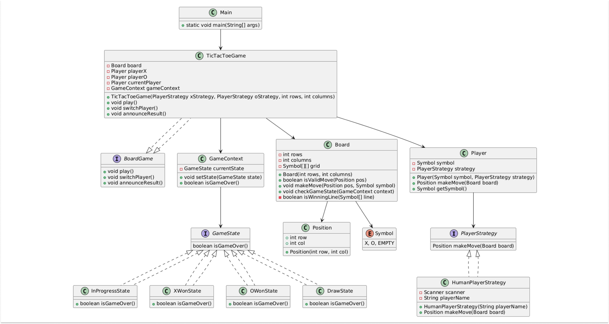
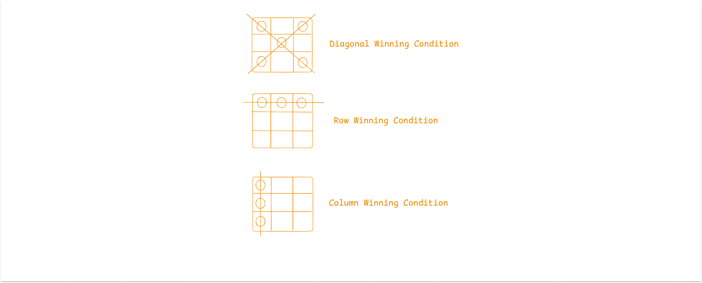
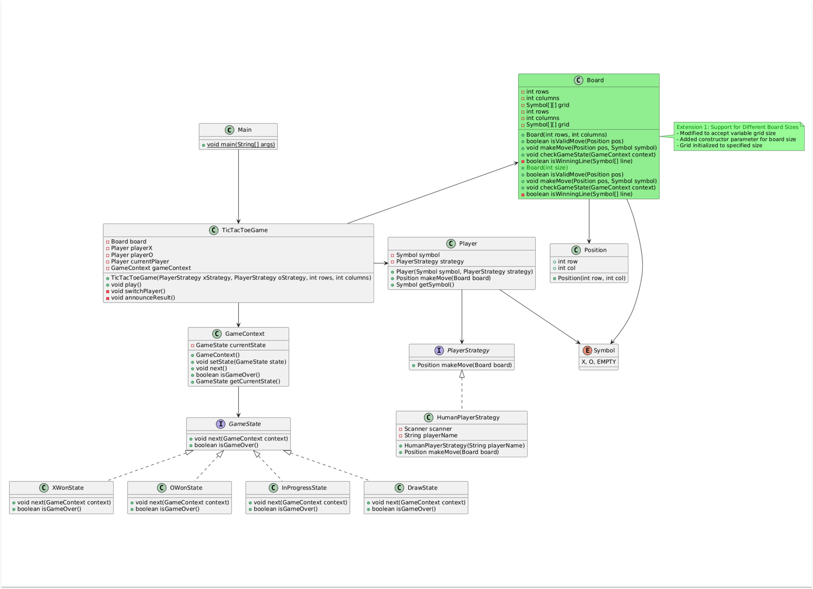
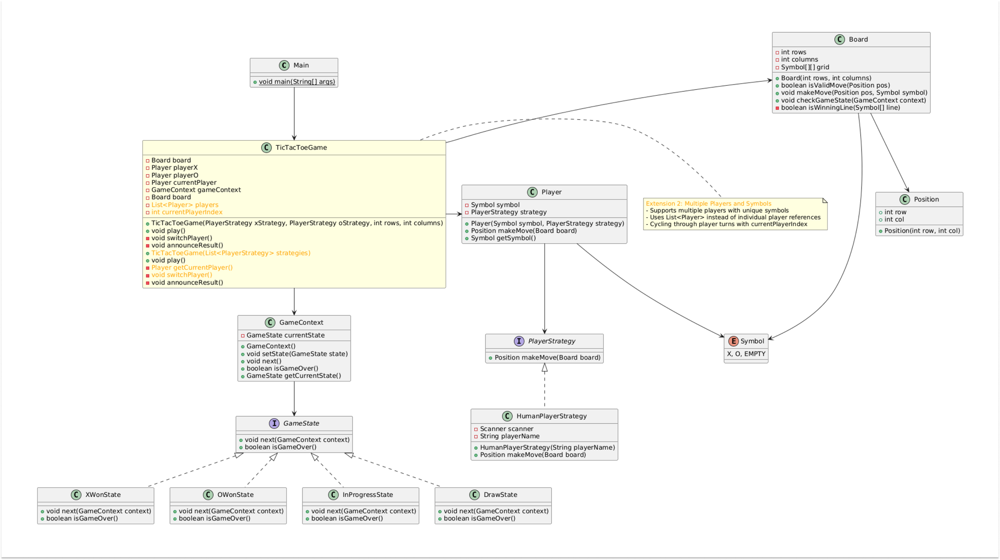
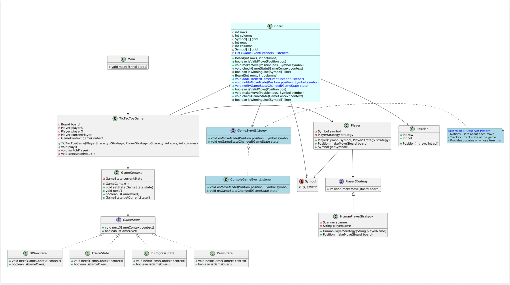
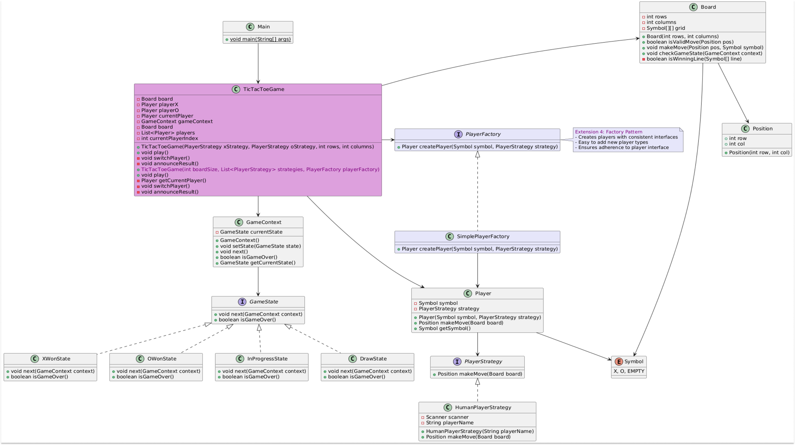

# Design Tic Tac Toe Game 🎲
Tic Tac Toe, known colloquially as "Xs and Os," is a two-player game typically played on a 3x3 grid. The objective is simple: be the first to form a horizontal, vertical, or diagonal line of three of your marks (either "X" or "O"). The elegance of the game lies in its deceptive complexity, while the rules are straightforward, devising an unbeatable strategy demands a keen understanding of the game's dynamics.

- https://codewitharyan.com/tech-blogs/design-tic-tac-toe-game
- [YouTube](https://youtu.be/0-TIqvK6sh8?si=2Ubiz8WVHoNao9I5)

## Rules of the game : 
Firstly let's understand the rules of the game:

- **Setup**: The game is played on a 3 * 3 grid. One player uses 'X' another player uses 'O' and each player takes turns making their moves.
- **Winner**: The game is won by the player placing his or her symbol in a row, column, or diagonal. The first player to get three symbols in a row wins the game. When the player reaches this, the game ends immediately.
- **Draw**: If all the grid cells are filled and no player has three symbols in a row, the game will be a tie or a draw.
- **Illegal Moves**: A player cannot place his or her symbol on a tile occupied by an opponent's symbol or their own symbol. The move must be made to an empty cell.

---

# 1. Interview Setting 🤝
### Point 1 : Introduction and Vague Problem Statement

**🧑‍💼Interviewer**: Let's start with a basic problem statement. Design a Tic Tac Toe game system.

**🧑‍💻Candidate**: Certainly! Let me outline the flow of the game based on my understanding of the Tic Tac Toe game first:
- We have a standard 3x3 grid.
- Two players take turns marking the spaces on the grid with 'X' and 'O'.
- The game continues until one player gets three of their marks in a row (horizontal, vertical, or diagonal), or the grid is filled resulting in a draw.

Is this the kind of game flow you had in mind?

**🧑‍💼Interviewer**: Yes, you are in-line with the flow, Please continue ahead.

**🧑‍💻Candidate**: Sure, I'd like to clarify a few requirements to ensure we're on the same page:
- Are we focusing on a standard 3x3 board?
- Will this be a two-player human game?
- What are the core requirements ?


### Point 2 : Clarifying requirements
**🧑‍💼Interviewer**: We want a simple system that:
- Supports a standard 3x3 Tic Tac Toe game
- Allows two human players to play
- Provides move validation
- Detects win or draw conditions

**🧑‍💻Candidate**: To ensure we're on the same page, let me write down the key requirements:
1. A 3x3 game board.
2. Two human players.
3. Alternating turns between 'X' and 'O'.
4. Move validation to ensure no wrong moves are made.
5. Detection of win or draw scenarios
   
**🧑‍💼Interviewer**: Perfect, Let's Proceed.


### Point 3 : Identifying Key Components :
**🧑‍💻Candidate**: Now that we have the requirements clarified, let's identify the key components of our Tic Tac Toe system:

1. **Piece**: Represents 'X' and 'O'.
   - Enum: Symbol
   - Description: This enum represents the two possible pieces in the game: 'X' and 'O', as well as an empty cell.
   ````java
   public enum Symbol {
	  X, O, EMPTY
	}
   ````
2. **Board**: The 3x3 grid where the game is played
   - Class: Board
   - Description: This class represents the game board, which can be of any size. It includes methods for validating moves, making moves, and checking the game state.

    ````java
    public class Board {    
    }
    ````    
2. **Player**:
    ````java
    public class Player {
    }
    ````
**🧑‍💼Interviewer**: That sounds good. Let's proceed with the design details for these components.


### Point 4 : Design Challenges
**🧑‍💼Interviewer**: That sounds good. Let's proceed with the design details for these components.

**🧑‍💻Candidate**: The Key challenges for the Tic Tac Toe game will include:
- Managing Game State: Ensuring the system accurately reflects the current state of the game, including player turns and board status.
- Implementing Move Validation: Verifying that each move is legal and within the rules of the game.
- Tracking Player Turns: Ensuring that players alternate turns correctly between 'X' and 'O'.
- Detecting Game-Ending Conditions: Accurately identifying win or draw scenarios to conclude the game appropriately.


### Point 5: Approach
**🧑‍💼Interviewer**: How would you approach these challenges to ensure our game doesn't break ?

**🧑‍💻Candidate**: To tackle the design challenges, I propose utilizing design patterns effectively. Here are the strategies which I am considering along with the examples :

1. Strategy Pattern for Player Interactions:
   - Define a Consistent Player Interface: Implement a common interface for players, ensuring consistent interactions.
   - Allow Flexible Player Move Implementations: Enable different move strategies (e.g., random move for an AI player, user input for a human player).
   - Example: A player interface with a makeMove() method that can be implemented differently for human and AI players.
2. State Pattern for Game Flow Management:
   - Manage Different Game States: Clearly define states such as in-progress, won, and draw.
   - Handle State Transitions Systematically: Ensure smooth transitions between states, like moving from in-progress to a win state. ‍
   - Example: A GameState class with methods to transition between states based on game conditions.
3. Observer Pattern for Game Event Tracking:
   - Notify Listeners about Game State Changes: Allow components to listen for and react to game state changes.
   - Support Potential Future Extensions: Facilitate extensions like logging, notifications, or UI updates.
   - Example: A GameEventListener that gets notified when a player makes a move, or the game state changes.
4. Factory Pattern for Player Creation:
   - Create Players with Consistent Interfaces: Use a factory to instantiate player objects, ensuring they adhere to the player interface.
   - Enable Easy Addition of Player Types: Allow for the seamless addition of new player types without modifying existing code.
   - Example: A PlayerFactory that creates instances of human or AI players based on configuration.

**🧑‍💼Interviewer**: That sounds like a solid approach. Let's delve into the design details for these patterns and components.


### Point 6 : Implementation
**🧑‍💼Interviewer**: Ready to discuss implementation?

**🧑‍💻Candidate**: Yes. I'll focus on a simple, readable design that meets the core Tic Tac Toe requirements.


---

# 2. Tic Tac Toe Design with Patterns


## 2.1. Strategy Pattern: Player Move Strategies : 
The Strategy Pattern allows defining a family of algorithms or strategies and making them interchangeable. In the context of player move strategies, the PlayerStrategy interface defines a method makeMove(Board board) that all concrete strategies must implement. This approach allows different player strategies, such as human or AI, to be used interchangeably without modifying the client code.

````java
// Strategy Interface for Player Moves
// Defines a makeMove(Board board) method.
public interface PlayerStrategy {
  // Allows different player strategies to be used interchangeably without
  // modifying client code.
  Position makeMove(Board board);
}
// Concrete Strategy for Human Player
// Implements the PlayerStrategy interface.
public class HumanPlayerStrategy implements PlayerStrategy {
  private Scanner scanner;
  private String playerName;
  // HumanPlayerStrategy Constructor
  public HumanPlayerStrategy(String playerName) {
    this.playerName = playerName;
    this.scanner = new Scanner(System.in);
  }
  @Override
  public Position makeMove(Board board) {
    while (true) {
      System.out.printf(
          "%s, enter your move (row [0-2] and column [0-2]): ", playerName);
      try {
        // Prompts the human player to enter their move.
        int row = scanner.nextInt();
        int col = scanner.nextInt();
        Position move = new Position(row, col);
        // Validates the player's input.
        // If the move is valid, returns the position.
        if (board.isValidMove(move)) {
          return move;
        }
        // If the move is invalid, prompts the player to try again.
        System.out.println("Invalid move. Try again.");
      } catch (Exception e) {
        System.out.println(
            "Invalid input. Please enter row and column as numbers.");
        scanner.nextLine(); // Clear input buffer
      }
    }
  }
}
````
Benefits of using the Strategy Pattern:
- Easily add new player strategies, such as AI or networked players.
- No need to change the existing codebase.


## 2.2. State Pattern: Game State Management : 
The State Pattern is a behavioral design pattern that allows an object to alter its behavior when its internal state changes. In the context of game state management, the GameState enum defines the various states a game can be in, such as IN_PROGRESS, X_WON, O_WON, and DRAW. Each state has an associated boolean value indicating whether the game is over.

### 2.1. Defining the Game Interface:
First, define a GameState interface that outlines the behavior for each state.
````java
public interface GameState {
    void next(GameContext context);
    boolean isGameOver();
}
````

### 2.2. Concrete States : 
Next, implement concrete state classes for each game state: XTurnState and OTurnState.

````java
// Concrete State: XTurnState
public class XTurnState implements GameState {
  @Override
  public void next(GameContext context) {
    // Switch to OTurnState
    context.setState(new OTurnState());
  }
  @Override
  public boolean isGameOver() {
    return false;
  }
}
````

````java
// Concrete State: OTurnState
public class OTurnState implements GameState {
  @Override
  public void next(GameContext context) {
    // Switch to XTurnState
    context.setState(new XTurnState());
  }
  @Override
  public boolean isGameOver() {
    return false;
  }
}
````

````java
// Concrete State: XWonState
public class XWonState implements GameState {
  @Override
  public void next(GameContext context) {
    // Game over, no next state
  }
  @Override
  public boolean isGameOver() {
    return true;
  }
}
````

````java
// Concrete State: OWonState
public class OWonState implements GameState {
  @Override
  public void next(GameContext context) {
    // Game over, no next state
  }
  @Override
  public boolean isGameOver() {
    return true;
  }
}
````

## 2.3. Context Class : 
Create a GameContext class that maintains a reference to the current state and delegates state-specific behavior to the current state.
````java
// GameContext Class
public class GameContext {
    private GameState currentState;
    public GameContext() {
        currentState = new XTurnState(); // Start with X's turn
    }
    public void setState(GameState state) {
        this.currentState = state;
    }
    public void next() {
        currentState.next(this);
    }
    public boolean isGameOver() {
        return currentState.isGameOver();
    }
    public GameState getCurrentState() {
        return currentState;
    }
}
````
The GameState interface defines the contract for different game states, each implementing specific behavior. This encapsulates state-specific logic, providing a clean way to manage game states.


---

## 3. Board Representation : 
The Board class represents the game board for a Tic-Tac-Toe game and includes methods for validating moves, making moves, and checking the game state. The board is initialized as a grid with all positions set to Symbol.EMPTY.


````java
// Board Representation
public class Board {
  private final int rows;
  private final int columns;
  private Symbol[][] grid;
  public Board(int rows, int columns) {
    this.rows = rows;
    this.columns = columns;
    grid = new Symbol[rows][columns];
    for (int i = 0; i < rows; i++) {
      for (int j = 0; j < columns; j++) {
        grid[i][j] = Symbol.EMPTY;
      }
    }
  }
  
  // Checks if a given position is within the bounds of the board.
  public boolean isValidMove(Position pos) {
    return pos.row >= 0 && pos.row < rows && pos.col >= 0 && pos.col < columns
        && grid[pos.row][pos.col] == Symbol.EMPTY;
  }
  
  // Allows players to make their moves
  public void makeMove(Position pos, Symbol symbol) {
    grid[pos.row][pos.col] = symbol;
  }
  
  // Determines the current state of the game by checking for
  // Rows, Columns and Diagonals for winning conditions
  public void checkGameState(GameContext context) {
    for (int i = 0; i < rows; i++) {
      if (grid[i][0] != Symbol.EMPTY && isWinningLine(grid[i])) {
        context.next();
        return;
      }
    }
    for (int i = 0; i < columns; i++) {
      Symbol[] column = new Symbol[rows];
      for (int j = 0; j < rows; j++) {
        column[j] = grid[j][i];
      }
      if (column[0] != Symbol.EMPTY && isWinningLine(column)) {
        context.next();
        return;
      }
    }
    Symbol[] diagonal1 = new Symbol[Math.min(rows, columns)];
    Symbol[] diagonal2 = new Symbol[Math.min(rows, columns)];
    for (int i = 0; i < Math.min(rows, columns); i++) {
      diagonal1[i] = grid[i][i];
      diagonal2[i] = grid[i][columns - 1 - i];
    }
    if (diagonal1[0] != Symbol.EMPTY && isWinningLine(diagonal1)) {
      context.next();
      return;
    }
    if (diagonal2[0] != Symbol.EMPTY && isWinningLine(diagonal2)) {
      context.next();
      return;
    }
    // Additional logic to handle a draw or continue in progress can be added
    // here
  }
  
  private boolean isWinningLine(Symbol[] line) {
    Symbol first = line[0];
    for (Symbol s : line) {
      if (s != first) {
        return false;
      }
    }
    return true;
  }
}
````

### Board Class Overview:
1. Represents the game board for a Tic-Tac-Toe game.
2. Includes methods for:
   - Validating moves.
   - Making moves.
   - Checking the game state. 
6. Initialized as a grid with all positions set to Symbol.EMPTY.


### Running the Game : (Controller Pattern) :
The TicTacToeGame class handles the game's flow. It takes care of the game board, the players, and whose turn it is. Here's how it works:

````java
interface BoardGames {
  // This interface illustrates how a large game company can manage multiple
  // types of games, including board games and non-board games. Tic Tac Toe is
  // an example of a game that is a child of the BoardGames interface.
  void play();
}
````

````java
// Initializes the game board and players with their respective strategies.
// Sets the current player to playerX. can be set to playerO as well
// TicTacToe.java
public class TicTacToeGame implements BoardGames {
  private Board board;
  private Player playerX;
  private Player playerO;
  private Player currentPlayer;
  private GameContext gameContext;
  
  // Initializes the game board and players with their respective strategies.
  // Sets the current player to playerX. can be set to playerO as well
  public TicTacToeGame(PlayerStrategy xStrategy, PlayerStrategy oStrategy,
      int rows, int columns) {
    board = new Board(rows, columns);
    playerX = new Player(Symbol.X, xStrategy);
    playerO = new Player(Symbol.O, oStrategy);
    currentPlayer = playerX;
    gameContext = new GameContext();
  }
  
  @Override  
  public void play() { // Loop continues until the game state indicates that the game is over.
    do {
      // print the current state of the game
      board.printBoard();
      // current player makes the move
      Position move = currentPlayer.makeMove(board);
      board.makeMove(move, currentPlayer.getSymbol());
      // checks game state for win/draw
      board.checkGameState(gameContext);
      switchPlayer();
    } while (!gameContext.isGameOver());
    announceResult();
  }
  
  // Alternates the current player after each move.
  // Ensures both players take turns
  private void switchPlayer() {
    currentPlayer = (currentPlayer == playerX) ? playerO : playerX;
  }
  
  // Displays the outcome of the game based on the final game state.
  private void announceResult() {
    GameState state = gameContext.getCurrentState();
    if (state instanceof XWonState) {
      System.out.println("Player X wins!");
    } else if (state instanceof OWonState) {
      System.out.println("Player O wins!");
    } else {
      System.out.println("It's a draw!");
    }
  }
}
````
TicTacToeGame Class Overview:
1. Manages the game flow using the Controller Pattern.
2. Manages the game board, players, and the current player.
3. Ensures smooth game progression.

---

## 4. Encapsulation and Separation of Concerns:
1. Encapsulates game flow logic within the TicTacToeGame class.
2. Achieves a clear separation of concerns.
3. Makes the code more modular and maintainable.
4. Allows for easy modifications and extensions, such as:
   - Adding new player strategies.
   - Changing the game rules.
   - Without affecting the core game logic.
5. Main Method to Run the Game

````java
// The main method serves as the entry point for the Tic-Tac-Toe game
// application. It initializes the player strategies and starts the game.
public class Main {
  public static void main(String[] args) {
    PlayerStrategy playerXStrategy = new HumanPlayerStrategy("Player X");
    PlayerStrategy playerOStrategy = new HumanPlayerStrategy("Player O");
    TicTacToeGame game = new TicTacToeGame(playerXStrategy, playerOStrategy);
    game.play();
  }
}
````
🧑‍💼Interviewer: Sounds good. What makes your approach effective?

🧑‍💻Candidate: Here are the key strengths of my approach:
- Simplicity: The design is kept minimal and straightforward, avoiding unnecessary complexity.
- Clarity: It's easy to understand, which makes it accessible for developers to implement and maintain.
- Efficiency: The implementation is direct and logical, ensuring smooth gameplay.
- Separation of Concerns: Each component has a clear responsibility, enhancing modularity and ease of updates.

---


## 5. Extensibility (Further Improvement) : 

### 5.1 Support for Different Board Sizes : 

To allow different board sizes, the Board class accepts a variable grid size. This way we can make the board of any size rather than just 3*3.

````java
// Board Representation 
public class Board {
    private Symbol[][] grid;
    public Board(int size) { 
        grid = new char[size][size]; 
        for(int row = 0; row < size; row++){
            for(int col = 0; col < size; col++){
                grid[row][col] = Symbol.Empty;
            }
        }
    }
}
````

### 5.2 Multiple Players and Symbols : 
Instead of restricting the game to just two players (X and O), the design can support multiple players, each with a unique symbol. The Game class should accommodate a dynamic list of players and cycle through turns accordingly.

Instead of Having Multiple Players like the below code : 
````java
// Game Orchestration
public class TicTacToeGame {
  private Board board;
  private Player playerX;
  private Player playerO;
  private Player currentPlayer;

  public TicTacToeGame(PlayerStrategy xStrategy, PlayerStrategy oStrategy) {
    board = new Board();
    playerX = new Player(Symbol.X, xStrategy);
    playerO = new Player(Symbol.O, oStrategy);
    currentPlayer = playerX;
  }
````

We can just have a list of players and list of strategies.

````java
// Game Orchestration
public class TicTacToeGame {
  private Board board;
  private List<Player> players;
  private int currentPlayerIndex;
  public TicTacToeGame(List<PlayerStrategy> strategies) {
    board = new Board();
    players = new ArrayList<>();
    players.add(new Player(Symbol.X, strategies.get(0)));
    players.add(new Player(Symbol.O, strategies.get(1)));
    currentPlayerIndex = 0;
  }
````

---

### 5.3. Observer Pattern for Game Event Tracking :

Implement the Observer Pattern to notify users about each move, the current state of the game, and whose turn it is to play. This allows users to stay updated on game progress, receive notifications if they win or lose, and facilitates potential future extensions like logging and UI updates.


### 5.3.1. Implement the GameEventListener Interface and Concrete Listener Class.
````java
// GameEventListener Interface
public interface GameEventListener {
  void onMoveMade(Position position, Symbol symbol);
  void onGameStateChanged(GameState state);
}

// Concrete Listener Class
public class ConsoleGameEventListener implements GameEventListener {
  @Override
  public void onMoveMade(Position position, Symbol symbol) {
    System.out.println("Move made at position: " + position + " by " + symbol);
  }
  @Override
  public void onGameStateChanged(GameState state) {
    System.out.println("Game state changed to: " + state);
  }
}
````

### 5.3.2. Modify the Board class code to accommodate Listener Class wherever we need to update user about an event : 
1. Implement the new Notification methods in the Main class :
````java
// Integration in the Board Class
public class Board {
    private final int rows;
    private final int columns;
    private Symbol[][] grid;
    private List<GameEventListener> listeners;

    public Board(int rows, int columns) {
        this.rows = rows;
        this.columns = columns;
        grid = new Symbol[rows][columns];
        listeners = new ArrayList<>();
        for (int i = 0; i < rows; i++) {
            for (int j = 0; j < columns; j++) {
                grid[i][j] = Symbol.EMPTY;
            }
        }
    }

    public void addListener(GameEventListener listener) {
        listeners.add(listener);
    }

    // Notifies users whever a move is been made
    public void notifyMoveMade(Position position, Symbol symbol) {
        for (GameEventListener listener : listeners) {
            listener.onMoveMade(position, symbol);
        }
    }

    // Notifies user on change of game state
    public void notifyGameStateChanged(GameState state) {
        for (GameEventListener listener : listeners) {
            listener.onGameStateChanged(state);
        }
    }
}
````

2. makeMove() Method : 
````java
public void makeMove(Position pos, Symbol symbol) {
        grid[pos.row][pos.col] = symbol;
        notifyMoveMade(pos, symbol); // Notify listeners when a move is made
}
````

3. CheckGameState() Method : 
````java
public void checkGameState(GameContext context) {
  // Row and Column Win condition checks
  for (int i = 0; i < rows; i++) {
    if (grid[i][0] != Symbol.EMPTY && isWinningLine(grid[i])) {
      GameState newState =
          grid[i][0] == Symbol.X ? new XWonState() : new OWonState();
      context.setState(newState);
      notifyGameStateChanged(
          newState); // Notify listeners when the game state changes
      return;
    }
  }
  for (int i = 0; i < columns; i++) {
    Symbol[] column = new Symbol[rows];
    for (int j = 0; j < rows; j++) {
      column[j] = grid[j][i];
    }
    if (column[0] != Symbol.EMPTY && isWinningLine(column)) {
      GameState newState =
          column[0] == Symbol.X ? new XWonState() : new OWonState();
      context.setState(newState);
      notifyGameStateChanged(
          newState); // Notify listeners when the game state changes
      return;
    }
  }
  // Diagonal checks
  Symbol[] diagonal1 = new Symbol[Math.min(rows, columns)];
  Symbol[] diagonal2 = new Symbol[Math.min(rows, columns)];
  for (int i = 0; i < Math.min(rows, columns); i++) {
    diagonal1[i] = grid[i][i];
    diagonal2[i] = grid[i][columns - 1 - i];
  }
  if (diagonal1[0] != Symbol.EMPTY && isWinningLine(diagonal1)) {
    GameState newState =
        diagonal1[0] == Symbol.X ? new XWonState() : new OWonState();
    context.setState(newState);
    notifyGameStateChanged(
        newState); // Notify listeners when the game state changes
    return;
  }
  if (diagonal2[0] != Symbol.EMPTY && isWinningLine(diagonal2)) {
    GameState newState =
        diagonal2[0] == Symbol.X ? new XWonState() : new OWonState();
    context.setState(newState);
    notifyGameStateChanged(
        newState); // Notify listeners when the game state changes
    return;
  }
  // Draw check
  for (int row = 0; row < rows; row++) {
    for (int col = 0; col < columns; col++) {
      if (grid[row][col] == Symbol.EMPTY) {
        context.setState(new InProgressState());
        return;
      }
    }
  }
  context.setState(new DrawState());
  notifyGameStateChanged(
      new DrawState()); // Notify listeners when the game state changes
}
private boolean isWinningLine(Symbol[] line) {
  Symbol first = line[0];
  for (Symbol s : line) {
    if (s != first) {
      return false;
    }
  }
  return true;
}
````


### 5.4. Factory Pattern for Player Creation:

Implement the Factory Pattern to create players with consistent interfaces, making it easy to add new player types and ensuring they adhere to the player interface. This allows for seamless integration of human or AI players based on configuration.

1. Creation of Factory interface and Concrete Factory class : 
````java
// PlayerFactory Interface
public interface PlayerFactory {
  Player createPlayer(Symbol symbol, PlayerStrategy strategy);
}


// Concrete PlayerFactory Class
public class SimplePlayerFactory implements PlayerFactory {
  @Override
  public Player createPlayer(Symbol symbol, PlayerStrategy strategy) {
    return new Player(symbol, strategy);
  }
}

````
2. Usage in TicTacToeGame Class :
````java
// Usage in TicTacToeGame Class
public class TicTacToeGame {
  private Board board;
  private List<Player> players;
  private int currentPlayerIndex;
  // Constructor to initialize the game with multiple players
  public TicTacToeGame(int boardSize, List<PlayerStrategy> strategies,
      PlayerFactory playerFactory) {
    board = new Board(boardSize); // Initialize the board with a given size
    players = new ArrayList<>();
    for (int i = 0; i < strategies.size(); i++) {
      Symbol symbol =
          Symbol.values()[i]; // Assign a unique symbol to each player
      players.add(playerFactory.createPlayer(
          symbol, strategies.get(i))); // Use the factory to create players
    }
    currentPlayerIndex = 0; // Start with the first player
  }
  // Method to get the current player
  private Player getCurrentPlayer() {
    return players.get(currentPlayerIndex);
  }
  // Method to switch to the next player
  private void switchPlayer() {
    currentPlayerIndex = (currentPlayerIndex + 1) % players.size();
  }
  // Method to start and run the game
  public void play() {
    GameState gameState;
    do {
      board.printBoard();
      Player currentPlayer = getCurrentPlayer();
      Position move = currentPlayer.makeMove(board);
      board.makeMove(move, currentPlayer.getSymbol());


      gameState = board.checkGameState();
      switchPlayer();
    } while (!gameState.isGameOver());


    announceResult(gameState);
  }
  // Method to announce the result of the game
  private void announceResult(GameState state) {
    switch (state) {
      case X_WON:
        System.out.println("Player X wins!");
        break;
      case O_WON:
        System.out.println("Player O wins!");
        break;
      case DRAW:
        System.out.println("It's a draw!");
        break;
    }
  }
}
````

---
## Conclusion : 
This low-level design for Tic-Tac-Toe showcases a well-structured and scalable architecture, emphasizing modularity and extensibility. By supporting various enhancements such as custom board sizes and multiple players, this design ensures maintainability and flexibility. In an interview setting, presenting this design would demonstrate your ability to create robust and adaptable solutions, highlighting your proficiency in applying design patterns and best practices.